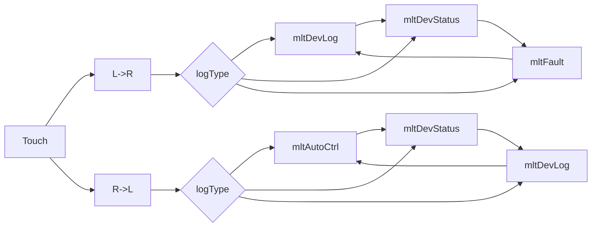

# SG1210 v2.5 表单设计

## 文档说明
用途：设计SG1210中各Form的显示特性和行为
版本：v2.10
作者：Wey. SilverGrid
日期：2026年6月28日

>--------------------------------------------------
## 变更记录：


## 约定：

1. 坐标系统：
   - 屏幕左上角为(0,0)
   - 屏幕右下角为(width-1, height-1)
2. 单点坐标(x,y)
  - 屏幕上的绝对坐标点
3. 区域(x,y,w,h)
   - 区域的左上角为(x, y)
   - 宽度为(w,h)
   - 区域包含点(x,y)
4. 文字：
   - 用一对引号包含的文字，直接用于显示
     - 如："SG1210"
   - 由常量标识的文字，用GetMultiLangString获取
     - 如：idDevFuncSUTC
     - 则是通过 GetMultiLangString(idDevFuncSUTC) 获得文字
     - GetMultiLangString返回的结果要作nullptr差别，为nullptr时，跳过显示
5. 颜色：
   - 本文出现的颜色均为RGB888
   - 表示形式为：\#RRGGBB， 以16进制数表示
6. 取值：
   - 数值寄存器：_GetRealReg(n)
     - 浮点数，不需要系数
   - 状态存贮器：_GetIOStateReg(n)
     - 二值：STATE_TRUE， STATE_FALSE
   - 其它：定义项中的指定函数
     - 执行方法调用
7. 图片
   - Form中出现的图片，均要求以RGB565编码
   - Firmware不支持转码。

## 一、GSplashForm

### 1.1 创建和退出
1. 创建：
   - 装置上电，由GUIStart创建
   - 在GMainForm中按ESC键，切入
2. 退出
   - 显示后开始计时，超30秒后，退出，切换到MainForm
   - 检测到任何按键
   - 检测到触屏点击

### 1.2 交互元件

#### 1.2.1 Layer0元件
   
1. 背景图
   - 元件：图片
   - 图片名称：picbkg320x240Lcsg
   - 位置坐标：(0,0)

#### 1.2.2 Layer1元件

2. 标题行
   - 元件：文字Label
     - 名称：装置型号
     - 字体：GUI_FONT_DIGCAP24B
     - 区域：(10, 64, 300, 26)  
     - 颜色：\#00b5f2
     - 背景：透明
     - 对齐：水平居中，垂直居中
     - 文字：idGPDevFamiry

   - 元件：文字Label
     - 名称：装置名称，中文
     - 字体：GUI_FONT_24LTH_CHN
     - 区域：(10, 102, 300, 24)
     - 颜色：\#00b5f2
     - 背景：透明
     - 对齐：水平居中，垂直居中
     - 文字：idDevFuncUVTC

   - 元件：文字Label
     - 名称：装置名称，英文
     - 字体：GUI_FONT_ASCII16B
      - 区域：(10, 128, 300, 17) 
     - 颜色：\#00b5f2
     - 背景：透明
     - 对齐：水平居中，垂直居中
     - 文字："Undervoltage Trip Controller"

3. 版权行
   - 元件：文字Label
     - 名称：版权信息
     - 字体：GUI_FONT_ASCII16B
     - 区域：(10, 219, 300, 16) 
     - 颜色：\#00b5f2
     - 背景：透明
     - 对齐：水平居中，垂直居中
     - 文字：idDevCopyright

4. Logo
   - 元件：图片
     - 名称：Logo
     - 图集：picMAUAtlascsg
     - 子图：picIdxMA_Logo80x20Cyan
     - 坐标：(120, 180)

## 二、GMainForm

### 2.1 创建和退出
1. 创建：
   - 由GSplashForm计时切入
   - GSplashForm中交互切入
   - GUI交互超时后切入
   - 从GMenuForm按ESC键切入
2. 退出
   - Enter键切入GMenuForm
   - ESC键切入GSplashForm

### 2.2 刷新规范

1. 更新周期
   - 日期时间： 1分钟
   - 测量数据： 10秒
   - 状态数据： 10秒
   - 状态图形： 1秒
   - 状态文字： 1秒

2. 更新策略
   - 日期时间：到周期就更新，暂存minute，比较minute
   - 测量数据、状态数据： 文字变化就刷新
   - 状态图形、图片：
     - 用_GetIOStateReg驱动，状态变化就触发更新
     - 用_GetRealReg驱动的，设定+/-10%死区，冲破死区触发更新
        - 例如：  阈值= 30V
        - 旧值 < 30V， 新值需 > 30 * 1.10 = 33V 触发更新
        - 旧值 > 30V， 新值需 < 30 * 0.90 = 27V 触发更新

### 2.3 交互元件

#### 2.3.1 Layer0元件
   
1. 背景图
   - 元件：图片
      - 名称：背景
      - 图片名称：picbkg320x240Lcsg
      - 位置坐标：(0,0)

2. Caption
``` 保留
//   - 元件：矩形
//      - 名称：Caption区域
//      - 区域：(0, 0, 320, 40)
//      - 线条：无
//      - 填充：\#041736 不透明度20%
```

   - 元件：线条
     - 名称：Caption分割
     - 区域：(0, 40, 320, 1)
     - 宽度：1
     - 颜色：#2f5ca6

``` 保留
//3. Logo
//   - 元件：图片
//      - 名称：Logo
//      - 图集：picMAUAtlascsg
//      - 子图：picIdxMA_Logo78x18
//      - 坐标：（121，220）
```

4. 测量数据Label
    - 元件：文字Label
      - 名称：输入电压
      - 字体：GUI_FONT_24LTH_CHN
      - 区域：(10, 8, 60, 24) 
      - 颜色：#ececec
      - 背景：透明
      - 对齐：水平左齐，垂直居中
      - 文字：idMainLabel01

    - 元件：文字Label
      - 名称：输出电压
      - 字体：GUI_FONT_24LTH_CHN
      - 区域：(170, 8, 60, 24) 
      - 颜色：#ececec
      - 背景：透明
      - 对齐：水平左齐，垂直居中
      - 文字：idMainLabel02

5. 状态数据Label
``` 保留
//    - 元件：文字Label
//      - 名称：充电电流
//      - 字体：GUI_FONT_ASCII16B
//      - 区域：(218, 170, 40, 16) 
//      - 颜色：\#ececec
//      - 背景：透明
//      - 对齐：水平左齐，垂直靠下
//      - 文字：idMainLabel03
//
//    - 元件：文字Label
//      - 名称：放电电流
//      - 字体：GUI_FONT_ASCII16B
//      - 区域：(218, 190, 40, 16) 
//      - 颜色：\#ececec
//      - 背景：透明
//      - 对齐：水平左齐，垂直靠下
//      - 文字：idMainLabel04
//      
//    - 元件：文字Label
//      - 名称：装置温度
//      - 字体：GUI_FONT_ASCII16B
//      - 区域：(10, 170, 96, 16) 
//      - 颜色：\#ececec
//      - 背景：透明
//      - 对齐：水平左齐，垂直靠下
//      - 文字：idMainLabel05
//
//    - 元件：文字Label
//      - 名称：电池电量
//      - 字体：GUI_FONT_ASCII16B
//      - 区域：(10, 190, 96, 16) 
	      - 颜色：查表 kBatIconTable[] 驱动（_BatColor），5级色值:
	        - >= 95%: #80FF80 (浅绿)
	        - >= 80%: #00FF00 (绿)
	        - >= 50%: #FFFF00 (黄)
	        - >= 20%: #FFA500 (橙)
	        - else:   #FF0000 (红)
//      - 对齐：水平左齐，垂直靠下
//      - 文字：idMainLabel06
```
   
6. 控制器区域
   - 元件：圆角矩形
      - 名称：控制器区域高亮
      - 区域：(110, 65, 100, 130)
      - 圆角半径：10
      - 线条：#1485b3 
      - 线宽：1
      - 填充：无
      - 锯齿： AA2

#### 2.3.2 Layer1元件
   
1. 测量数值区
    - 元件：数值Label
      - 名称：输入电压
      - 字体：GUI_FONT_24LTH_CHN
      - 区域：(70, 12, 80, 24)
      - 对齐：水平右齐，垂直居中
      - 单位：V
      - 格式：3位整数，1位小数
      - 数值寄存器：_GetRealReg(REG_RL_Uin)

    - 元件：数值Label
      - 名称：输出电压
      - 字体：GUI_FONT_24LTH_CHN
      - 区域：(230, 12, 80, 24)
      - 对齐：水平右齐，垂直居中
      - 单位：V
      - 格式：3位整数，1位小数
      - 数值寄存器：_GetRealReg(REG_RL_Uout)
   
2. 状态数据Label
``` 保留
//    - 元件：数值Label
//      - 名称：充电电流
//      - 字体：GUI_FONT_ASCII16B
//      - 区域：(260, 170, 48, 16)
//      - 对齐：水平右齐，垂直居中
//      - 单位：A
//      - 格式：2位整数，2位小数
//      - 数值寄存器：_GetRealReg(REG_RL_BCHRG_Ibus)
//  
//    - 元件：数值Label
//      - 名称：放电电流
//      - 字体：GUI_FONT_ASCII16B
//      - 区域：(260, 190, 48, 16)
//      - 对齐：水平右齐，垂直居中
//      - 单位：A
//      - 格式：2位整数，2位小数
//      - 数值寄存器：_GetRealReg(REG_RL_BTOUT_Ibus)
//
//    - 元件：数值Label
//      - 名称：装置温度
//      - 字体：GUI_FONT_ASCII16B
//      - 区域：(50, 170, 38, 16)
//      - 对齐：水平右齐，垂直居中
//      - 单位：℃
//      - 格式：2位整数，1位小数
//      - 数值寄存器：_GetRealReg(REG_RL_RTC_TEMP)
```
  - 元件：数值Label
    - 名称：电池电量
    - 字体：GUI_FONT_ASCII16B
    - 区域：(112, 118, 40, 16)
    - 对齐：水平右齐，垂直居中
    - - 数值寄存器：_GetRealReg(REG_RL_BCHRG_Level)
    - 单位：%
    - 格式：3位整数
    - 背景： #002040
    - 颜色：查表 kBatIconTable[] 驱动（_BatColor），5级色值:
       - \>= 95%: #80FF80 (浅绿)
       - \>= 80%: #00FF00 (绿)
       - \>= 50%: #FFFF00 (黄)
       - \>= 20%: #FFA500 (橙)
       -  else:   #FF0000 (红)

3. 状态图片
  - 元件：状态图片
    - 名称：控制器
	  - 图集名称：picMAUAtlascsg
	  - 图片序号：picIdxMA_CtrlG80x62Cyan
	  - 位置坐标：(120, 74)
	  - 显示模式：
  	  - 与LEDx3组合显示控制器工作状态
  	  - picIdxMA_CtrlG80x62Cyan的灯位置上是绿灯
  	  - 需要显示红灯时，向相应的位置上覆盖picIdxMA_CtrlLED13x13Red
	  - 显示方式：
  	  - LEDx3有红->绿时，用picIdxMA_CtrlG80x62Cyan刷新三个灯位置
  - 元件：状态图片
	  - 名称：控制器LEDx3 (LED1/LED2/LED3)
	  - 图集名称：picMAUAtlascsg
	  - 图片序号：picIdxMA_CtrlLED13x13Red
	  - 位置坐标：相对于“控制器“左上角
	      - > LED1 (AC输入):   (13, 19)
	      - > LED2 (逆变输出): (34, 33)
	      - > LED3 (断路器):   (55, 19)
	  - 显示逻辑：
  ```mermaid
  graph LR
  A[Controller] --> B{State}
  B --> C[passby] --> D1[LED1✅<br>LED2❌<br>LED3✅]
  B --> D2[else] 
  D2 --> F1{Uin}
  F1 --> G1[>33V] --> G3[LED1✅]
  F1 --> G2[<27V] --> G4[LED1❌]
  D2 --> F2{InvertorOk}
  F2 --> H1[true] --> H3[LED2✅]
  F2 --> H2[false] --> H4[LED2❌]
  D2 --> F3{Uout}
  F3 --> I1[>33V]  --> I3[LED3✅]
  F3 --> I2[<27V]  --> I4[LED3❌]
  ```
	- 元件：状态图片
	      - 名称：加热器
	      - 图集名称：picMAUAtlascsg
	      - 图片序号：picIdxMA_Fire16x16
	      - 位置坐标：(270, 221)
	      - 饱和度： 
	        - _GetIOStateReg(REG_stHeater) == STATE_TRUE: 100%
	        - else:  10%
  - 元件：状态图片
      - 名称：散热器
      - 图集名称：picMAUAtlascsg
      - 图片序号：picIdxMA_Fan16x16Cyan
      - 位置坐标：(293, 221)
      - 饱和度： 
        - _GetIOStateReg(REG_stFan) == STATE_TRUE: 100%
        - else:  10%
``` 保留
//5. 状态文字
//    - 元件：数值Label
//      - 名称：旁路状态
//      - 字体：GUI_FONT_24LTH_CHN
//      - 区域：(216, 160, 100, 25)
//      - 颜色：
//        - _GetIOStateReg(REG_stPassby) == STATE_TRUE: \#25b92c
//        - else:   \#f06d0d
//      - 背景：\#001838
//      - 对齐：水平居中，垂直居中
//      - 文字：用GetMultiLangString读取
//        - GetCoilState() == COIL_Passby:  (idMainStat06）
//        - GetCoilState() == COIL_KeepOff: (idMainStat05）
//        - GetCoilState() == COIL_KeepOn:  (idMainStat04）
//        - “”
```
4. 日期时间
    - 元件：文本Label
      - 名称：日期时间
      - 字体：GUI_FONT_ASCII16B
      - 区域：(10, 221, 120, 16)
      - 颜色：\#bdbdbd
      - 背景：\#001028  
      - 对齐：水平左齐，垂直居中
      - 文字：
        - MCU：用RTC_GetTime取时间
        - 模拟器：用GetLocalTime取时间
        - 日期时间格式： “yyyy-MM-dd HH:mm” 

#### 2.3.3 按钮
1. Menu按钮
   - 元件：图片按钮
      - 名称：Home
      - 图集名称：picMAUAtlascsg
      - 图片序号：picIdxMA_Menu20x20Cyan
      - 位置坐标：(286, 218)
      - 饱和度：70%
    - 动作：
      - 响应触屏单击
      - 切到: GMenuForm

## 三、GMenuForm

### 3.1 创建和退出
1. 创建：
   - 从GMainForm按Enter键切入
   - 从各子功能Form中返回
2. 退出
   - ESC键切入GMainForm
   - 点击Home图标切入GMainForm

### 3.2 刷新规范

1. 更新周期
   - 不主动更新
   - 后期可考虑有点背景动画

2. 刷新策略
  - Menu的ListView切换选项时，新旧选项及选择框所占区域刷新显示内容
  - 有触摸点击时，相应动作


### 3.3 交互元件

#### 3.3.1 Layer0元件
   
1. 背景图
   - 元件：图片
      - 名称：背景
      - 图片名称：picbkg320x240Lcsg
      - 位置坐标：(0,0)

2. Caption
   - 元件：线条
     - 名称：Caption分割
     - 区域：(0, 40, 320, 1)
     - 宽度：1
     - 颜色：\#2f5ca6  不透明度15%

3. Caption Label
    - 元件：文字Label
      - 名称：Form标题
      - 字体：GUI_FONT_24LTH_CHN
      - 区域：(60, 7, 221, 27)
      - 颜色：\#00b5f2
      - 背景：透明
      - 对齐：水平右齐，垂直居中
      - 文字：idMenuCaption

#### 3.3.2 Layer1元件

1. Home按钮
   - 元件：图片按钮
      - 名称：Home
      - 图集名称：picMAUAtlascsg
      - 图片序号：picIdxMU_Home24x22
      - 位置坐标：(8, 8)
      - 饱和度：100%
    - 动作：
      - 响应触屏单击
      - 切到: GMainForm

2. 提示信息 Label
    - 元件：文字Label
      - 名称：菜单项提示　
      - 字体：GUI_FONT_16LTH_CHN
      - 区域：(14, 221, 200, 16)
      - 颜色：\#00b5f2
      - 背景：\#070d28
      - 对齐：水平左齐，垂直居中
      - 文字：
        - 根据不同菜单项，提取说明文字在此处显示

3. 菜单项选取框
   此选取框用于给键盘操作者指示当前选中的菜单项，不用Alpha，用空心的选取框。
   用clip+CSG背景重绘取代旧MemDev方案。
    - 元件：圆角矩形
      - 名称：菜单项选取框
      - 区域：(-9, -5, 50, 60)  相对于菜单项图标左上角坐标
      - 圆角半径：4
      - 线条：\#4dc9fc 
      - 线宽：1
      - 填充：无
      - 锯齿：AA2

4. 菜单项
   
   1. 菜单项1
```
    - 元件：图片按钮
      - 名称：Data-List
      - 图集名称：picMAUAtlascsg
      - 图片序号：picIdxMU_Item32x32_01
      - 位置坐标：(24, 72)
      - 饱和度：100%

    - 元件：文字Label
      - 名称：Item Label 1
      - 字体：GUI_FONT_16LTH_CHN
      - 区域：(24, 107, 33, 17)
      - 颜色：\#00b5f2
      - 背景：透明
      - 对齐：水平右齐，垂直居中
      - 文字：idMenuName1
        
    - 动作：
      - 响应触屏单击
      - 切到: DataListForm

    - 说明文字： idMenuDesp1
```

  2. 菜单项2
```
    - 元件：图片按钮
      - 名称：Fatal-Log
      - 图集名称：picMAUAtlascsg
      - 图片序号：picIdxMU_Item32x32_02
      - 位置坐标：(86, 72)
      - 饱和度：100%

    - 元件：文字Label
      - 名称：Item Label 2
      - 字体：GUI_FONT_16LTH_CHN
      - 区域：(86, 107, 32, 17)
      - 颜色：\#00b5f2
      - 背景：透明
      - 对齐：水平右齐，垂直居中
      - 文字：idMenuName2
        
    - 动作：
      - 响应触屏单击
      - 切到: LogListForm (mltFault)

    - 说明文字： idMenuDesp2
```

   3. 菜单项3
```
    - 元件：图片按钮
      - 名称：System-Log
      - 图集名称：picMAUAtlascsg
      - 图片序号：picIdxMU_Item32x32_03
      - 位置坐标：(148, 72)
      - 饱和度：100%

    - 元件：文字Label
      - 名称：Item Label 3
      - 字体：GUI_FONT_16LTH_CHN
      - 区域：(148, 107, 33, 17)
      - 颜色：\#00b5f2
      - 背景：透明
      - 对齐：水平右齐，垂直居中
      - 文字：idMenuName3
        
    - 动作：
      - 响应触屏单击
      - 切到: GSystemLogForm

    - 说明文字： idMenuDesp3
```

   4. 菜单项4
```
    - 元件：图片按钮
      - 名称：Wavelog-List
      - 图集名称：picMAUAtlascsg
      - 图片序号：picIdxMU_Item32x32_04
      - 位置坐标：(210, 72)
      - 饱和度：100%

    - 元件：文字Label
      - 名称：Item Label 4
      - 字体：GUI_FONT_16LTH_CHN
      - 区域：(210, 107, 33, 17)
      - 颜色：\#00b5f2
      - 背景：透明
      - 对齐：水平右齐，垂直居中
      - 文字：idMenuName4
        
    - 动作：
      - 响应触屏单击
      - 切到: WLGListForm

    - 说明文字： idMenuDesp4
```

  5. 菜单项5 
```
    - 元件：图片按钮
      - 名称：Device-Test
      - 图集名称：picMAUAtlascsg
      - 图片序号：picIdxMU_Item32x32_05
      - 位置坐标：(272, 72)
      - 饱和度：100%

    - 元件：文字Label
      - 名称：Item Label 5
      - 字体：GUI_FONT_16LTH_CHN
      - 区域：(272, 107, 33, 17)
      - 颜色：\#00b5f2
      - 背景：透明
      - 对齐：水平右齐，垂直居中
      - 文字：idMenuName5
        
    - 动作：
      - 响应触屏单击
      - 切到: DeviceTestForm

    - 说明文字： idMenuDesp5
```

  6. 菜单项6
```
    - 元件：图片按钮
      - 名称：Logic-Config
      - 图集名称：picMAUAtlascsg
      - 图片序号：picIdxMU_Item32x32_06
      - 位置坐标：(24, 145)
      - 饱和度：100%

    - 元件：文字Label
      - 名称：Item Label 6
      - 字体：GUI_FONT_16LTH_CHN
      - 区域：(24, 180, 33, 17)
      - 颜色：\#00b5f2
      - 背景：透明
      - 对齐：水平右齐，垂直居中
      - 文字：idMenuName6
        
    - 动作：
      - 响应触屏单击
      - 切到: CTRLConfigForm

    - 说明文字： idMenuDesp6
```

  7. 菜单项7
```
    - 元件：图片按钮
      - 名称：Device-Config
      - 图集名称：picMAUAtlascsg
      - 图片序号：picIdxMU_Item32x32_07
      - 位置坐标：(86, 145)
      - 饱和度：100%

    - 元件：文字Label
      - 名称：Item Label 7
      - 字体：GUI_FONT_16LTH_CHN
      - 区域：(86, 180, 32, 17)
      - 颜色：\#00b5f2
      - 背景：透明
      - 对齐：水平右齐，垂直居中
      - 文字：idMenuName7
        
    - 动作：
      - 响应触屏单击
      - 切到: ConfigForm

    - 说明文字： idMenuDesp7
```

  8. 菜单项8
```
    - 元件：图片按钮
      - 名称：Serial-Config
      - 图集名称：picMAUAtlascsg
      - 图片序号：picIdxMU_Item32x32_08
      - 位置坐标：(148, 145)
      - 饱和度：100%

    - 元件：文字Label
      - 名称：Item Label 8
      - 字体：GUI_FONT_16LTH_CHN
      - 区域：(148, 180, 33, 17)
      - 颜色：\#00b5f2
      - 背景：透明
      - 对齐：水平右齐，垂直居中
      - 文字：idMenuName8
        
    - 动作：
      - 响应触屏单击
      - 切到: UARTConfigForm

    - 说明文字： idMenuDesp8
```

  9. 菜单项9
```
    - 元件：图片按钮
      - 名称：Ethernet-Config
      - 图集名称：picMAUAtlascsg
      - 图片序号：picIdxMU_Item32x32_09
      - 位置坐标：(210, 145)
      - 饱和度：100%

    - 元件：文字Label
      - 名称：Item Label 9
      - 字体：GUI_FONT_16LTH_CHN
      - 区域：(210, 180, 33, 17)
      - 颜色：\#00b5f2
      - 背景：透明
      - 对齐：水平右齐，垂直居中
      - 文字：idMenuName9
        
    - 动作：
      - 响应触屏单击
      - 切到: EthernetConfigForm

    - 说明文字： idMenuDesp9
```

  10.    菜单项10
```
    - 元件：图片按钮
      - 名称：About
      - 图集名称：picMAUAtlascsg
      - 图片序号：picIdxMU_Item32x32_10
      - 位置坐标：(272, 145)
      - 饱和度：100%

    - 元件：文字Label
      - 名称：Item Label 10
      - 字体：GUI_FONT_16LTH_CHN
      - 区域：(272, 180, 33, 17)
      - 颜色：\#00b5f2
      - 背景：透明
      - 对齐：水平右齐，垂直居中
      - 文字：idMenuName10
        
    - 动作：
      - 响应触屏单击
      - 切到: AboutForm

    - 说明文字： idMenuDesp10
```

#### 3.3.3 菜单的规范

1. 上述10个菜单项构成一个菜单整体，背后由一个ListView管理；
2. 10个菜单项排列成2x5的矩阵；
3. 上、下、左、右键可切换【当前项】;
4. Enter激活菜单项的“动作”；
5. 菜单项在按键操作时的行为：
  - Enter按下后激活菜单项
6. 菜单项在触摸屏操作时的行为：
  - 对触摸屏单击的捕获区域，在菜单图标区域内，不被透明色穿透；
  - 捕捉到触摸屏单击后，激活菜单项动作。

## 四、DataListForm
DataListForm用于实时展示指定寄存器的名称和实时状态/值。
1. 采用手动ownerdraw列表（行为等同SWIPELIST，不依赖emWin窗口管理器）
2. 按寄存器分组，组织列表的顺序
3. 列表支持触摸滑动，同时支持按键移动

### 4.1 创建和退出
1. 创建：
   - 从GMenuForm的Data-List菜项激活后弹出
2. 退出
   - ESC键切回GMenuForm
   - 触摸向右滑动，切回GMenuForm
   - 触摸向左滑动，切入GLogListForm

### 4.2 刷新规范

1. 更新周期
   - 主动更新，
   - 每秒刷新一次，用实时状态/数据更新列表中的显示

2. 刷新策略
  - 寄存器的名称不需要刷新
  - 更新寄存器行中的实时数据区

### 4.3 交互元件

#### 4.3.1 Layer0元件
   
1. 背景图
   - 元件：图片
      - 名称：背景
      - 图片名称：picbkg320x240csg
      - 位置坐标：(0,0)

#### 4.3.2 Layer1元件

1. 列表
   - 元件：手动ownerdraw列表
      - 名称：实时列表
      - 区域：(15,4,290,232)
      - 显示方式：Ownerdraw
      - 字体：GUI_FONT_16LTH_CHN

#### 4.3.3 列表显示风格
显示风格由AI自己决定
1. 按分组显示列表
2. 每个组的组名有固定行引导
3. 信息行左侧是寄存器名称，右侧是寄存器值
4. 状态寄存器用图片显示
   - 图集名称：picMAUAtlascsg
   - STATE_FALSE：picIdxLV_CrossMark16x16Green
   - STATE_TRUE:  picIdxLV_CheckMark16x16Red

### 4.4 取数据/状态

#### 4.4.1 寄存器
1. 在Form中显示的信息，每个分组都是由一组寄存器地址组成。
   - 类型： uint32_t
  
2. 寄存器可由REG_TYPE区分类型
   - 类型定义在DevRegs.h中
   - 根据寄存器类型，用对应的宏取值，如：
     - REG_IOSTATE -> _GetIOStateReg
     - REG_REAL    -> _GetRealReg

3. 寄存器的属性
   - 通过 DevIntf_GetRegInfo( uRegNum ) 可取得寄存器的属性 TDevRegInfoItem*
     - TDevRegInfoItem.NameStrId是寄存器的名称
       - 通过GetMultiLangString，可取得寄存器的名称，在 Item 的 Title区显示
     - 通过 TDevRegInfoItem* 由 RINF_GetDIMNameEx 可取得寄存器的量纲
#### 4.4.2 从寄存器取显示信息
如下代码示例中：
   - title区：szRegName
   - Status区：
     - 数值类寄存器：szValue
     - 状态类寄存器：stImgIndex
```
  uint32_t uRegNum = REG_RL_Uin;
  const auto pRegProp = DevIntf_GetRegInfo( uRegNum );
  if( nullptr == pRegProp ) {
    return ;
  }

  // 取量纲名称
  const auto pDIMName = RINF_GetDIMNameEx( pRegProp );

  // 取寄存器名称
  const char* szRegName = GetMultiLangString( pRegProp->NameStrId );
  if( nullptr == szRegName ) {
    szRegName = pRegProp->pName;
  }

  // 浮点寄存器的取值
  char pcFmt[12];
  snprintf( pcFmt, sizeof(pcFmt), "%%0.%uf",  pRegProp->Decimal );

  // 生成数值显示字符串
  // 缓冲区szValue和nLength假设已提供
  auto fValue = _GetRealReg( uRegNum );
  auto pos = snprintf( szValue, nLength, pcFmt, fValue );
  if( nullptr != pDIMName && pos >= 0 ) {
    snprintf( szValue + pos, nLength - pos, "%s", pDIMName );
  }

  // 状态寄存器的取值
  auto stValue = _GetIOStateReg( uRegNum );
  uint32_t stImgIndex;
  if( STATE_TRUE == stValue ) {
    stImgIndex = picIdxLV_CheckMark16x16Red;
  } else {
    stImgIndex = picIdxLV_CrossMark16x16Green;
  }
```

### 4.5 寄存器分组
1. 交流信号
  - 名称id：idDVGroup01
  - 寄存器：
    - REG_RL_Uin、REG_RL_Uout、REG_RL_ACFreq、REG_RL_VOFreq
2. 锂电池
  - 名称id：idDVGroup02
  - 寄存器：
    - REG_RL_BCHRG_Pbus, REG_RL_BCHRG_Ibus, REG_RL_BCHRG_Ibus_Max
    - REG_RL_BTOUT_Pbus, REG_RL_BTOUT_Ibus, REG_RL_BTOUT_Ibus_Max
    - REG_RL_BAT_CAPLevel，REG_RL_BAT_TEMPERATRUE
3. 实时时钟
  - 名称id：idDVGroup03
  - 寄存器：
    - REG_RL_RTC_TEMP，REG_RL_RTC_Vbat
4. 状态信号
  - 名称id：idDVGroup04
  - 寄存器：
    - REG_DI0，REG_DI1，REG_DI2，REG_DI3，REG_DI4
    - REG_DI5，REG_DI6，REG_DI7
5. 控制信号
  - 名称id：idDVGroup05
  - 寄存器：
    - REG_RELAY0，REG_RELAY1，REG_RELAY2，REG_RELAY3

   
## 五、日志查询窗体
LogListForm用于查询各类Log。
1. 风格与DataListForm一致，但顶部有Caption，用于显示Log分类名称
2. Log行表由EVTMGR_
3. Log行表支持触摸滑动，同时支持按键移动

### 5.1 创建和退出
1. 创建：
   - 从GMenuForm的FatalLog菜项激活后弹出
   - Init以mltFault为参数进入
2. 退出
   - ESC键切回GMenuForm
   - 触摸向右滑动，切换Log分类或其它窗体，如下图：


### 5.2 刷新规范

1. 更新周期
   - 主动更新，
   - 每秒刷新一次，用实时状态/数据更新列表中的显示

2. 刷新策略
   - 寄存器的名称不需要刷新
   - 更新寄存器行中的实时数据区

### 5.3 交互元件

#### 5.3.1 Layer0元件
   
1. 背景图
   - 元件：图片
      - 名称：背景
      - 图片名称：picbkg320x240csg
      - 位置坐标：(0,0)

2. Form
   - 元件：矩形
     - 区域：(15,4,290,232)
     - 填色：参考DataListForm
     - 外框：参考DataListForm
     - 内框：参考DataListForm

3. Caption
   - 元件：文本框
     - 区域：(0,0,20,232) 相对Form
     - 字体：GUI_FONT_16LTH_CHN
     - 颜色：参考GPEventBrowserForm.drawCaptionLabel

#### 5.3.2 Layer1元件

1. 行表
   - 元件：手动ownerdraw列表，用于显示Log项
      - 名称：实时列表
      - 区域：参考DataListForm
      - 显示方式：Ownerdraw
      - 字体：GUI_FONT_16LTH_CHN
      - 颜色：参考DataListForm
      - 背景：参考DataListForm
      - 其它：参考DataListForm
2. 滚动条
  - 元件：滚动条
  - 区域：在Form区域左侧，宽度8
  - 风格与DataListForm一致

### 5.4 Log的过滤和获取

#### 5.4.1 Log的分类
参考GPEventBrowserForm中相关方法：
   - drawCaptionLabel

#### 5.4.1 Log的获取
参考GPEventBrowserForm中相关方法：
   - changeEventType
   - getEventList
   - _DrawItemInfo
